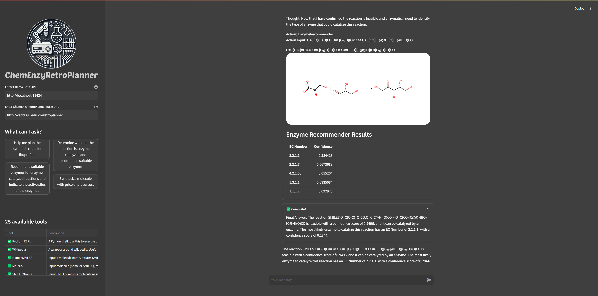

# ChemEnzyRetroPlanner Agent
This is an Agent paired with the ChemEnzyRetroPlanner API, adapted for Llama 3.1 based on ChemCrow, with partial localization of certain synthesis planning tools.  
## Introduction

## Installation Guide
```
git clone https://github.com/wangxr0526/ChemEnzyRetroPlanner_agent.git
cd ChemEnzyRetroPlanner_agent
conda env create -f envs.yml
conda activate retro_planner_agent_env
pip install -r requirements.txt
pip install chemprice
pip install -e ./agent
cd streamlit_app
streamlit run app.py
```

## Interface


## Demo Video
https://github.com/user-attachments/assets/5db4e35c-e95a-4c05-bbd8-99378c20f2c6


## Related repository
[ChemEnzyRetroPlanner](https://github.com/wangxr0526/ChemEnzyRetroPlanner.git)


## Cite Us

```bibtex
@article{wang_chemenzyretroplanner_2025,
	title = {A virtual platform for automated hybrid organic-enzymatic synthesis planning},
	volume = {},
	issn = {},
	url = {https://www.nature.com/articles/s41467-025-65898-3},
	doi = {10.1038/s41467-025-65898-3},
	urldate = {},
	journal = {Nature Communications},
	author = {Wang Xiaorui, Yin Xiaodan, Zhang Xujun, Zhao Huifeng, Gu Shukai, Wu Zhenxing, Zhang Odin, Qian Wenjia, Huang Yuansheng, Li Yuquan, Jiang Dejun, Wang Mingyang, Liu Huanxiang, Yao Xiaojun, Hsieh Chang-Yu, Hou Tingjun},
	month = ,
	year = {2025},
	pages = {},
}
```